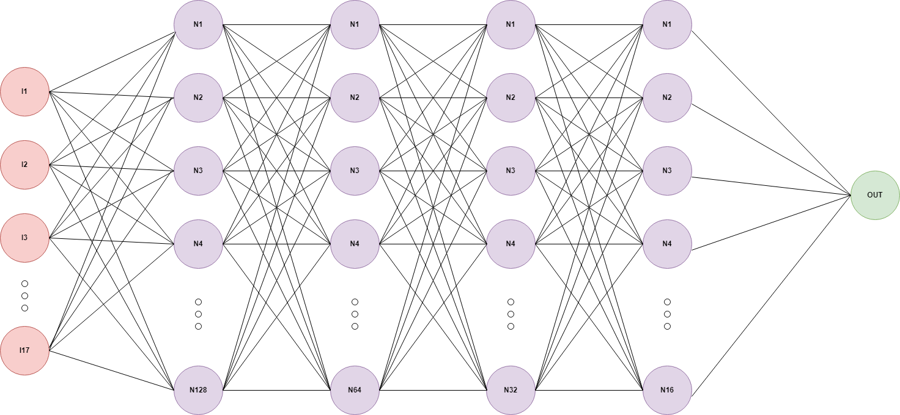

# Short-term Forecast com Redes Neurais
### Implementação de MLP que prevê a temperatura horária do dia seguinte.

## Contexto
Nesse projeto implementei um previsor de temperatura que prevê a temperatura horária das próximas 24 horas,
os dados utilizados vieram do INMET, na página: https://portal.inmet.gov.br/dadoshistoricos.
Dados da cidade de Goiânia, Goiás no periodo de 2015 à 2024 foram utilizados para treinamento.

A planilha de dados tem a seguinte estrutura:

* Data	
* Hora UTC	
* PRECIPITAÇÃO TOTAL, HORÁRIO (mm)	
* PRESSAO ATMOSFERICA AO NIVEL DA ESTACAO, HORARIA (mB)	
* PRESSÃO ATMOSFERICA MAX.NA HORA ANT. (AUT) (mB)	
* PRESSÃO ATMOSFERICA MIN. NA HORA ANT. (AUT) (mB)	
* RADIACAO GLOBAL (Kj/m²)	
* TEMPERATURA DO AR - BULBO SECO, HORARIA (°C)	
* TEMPERATURA DO PONTO DE ORVALHO (°C)	
* TEMPERATURA MÁXIMA NA HORA ANT. (AUT) (°C)	
* TEMPERATURA MÍNIMA NA HORA ANT. (AUT) (°C)	
* TEMPERATURA ORVALHO MAX. NA HORA ANT. (AUT) (°C)	
* TEMPERATURA ORVALHO MIN. NA HORA ANT. (AUT) (°C)	
* UMIDADE REL. MAX. NA HORA ANT. (AUT) (%)	
* UMIDADE REL. MIN. NA HORA ANT. (AUT) (%)	
* UMIDADE RELATIVA DO AR, HORARIA (%)	VENTO, DIREÇÃO HORARIA (gr) (° (gr))	
* VENTO, RAJADA MAXIMA (m/s)	
* VENTO, VELOCIDADE HORARIA (m/s)

O valores previstos são representantes do campo TEMPERATURA DO AR - BULBO SECO, HORARIA (°C).
No conjunto de dados temos informações que representam cada hora do dia, o primeiro conjunto e dados previsto são os dados do dia seguinte ao final do conjunto de treinamento e teste, e a previsão final é uma lista que corresponde à previsão de tempo horária das próximas 24 horas.
Ou seja, é um Short Term Forecast.

## Pré-processamento e normalização dos dados

O primeiro passo é o tratamento e normalização dos dados. O **src/data_preprocessing.py** é responsável por
carregar, pré-procesar e preparar os dados meteorológicos. A função **load_data()** lê o arquivo CSV utilizando Pandas e realiza uma limpeza inicial,
removendo linhas inteiramente vazias e excluindo linhas com valores inúteis para o treinamento. Depois disso são criados os features e o target é escolhido.

## Modelo: Multi-Layer Perceptron (MLP)

O projeto utiliza uma implementação de um Multi-Layer Perceptron (MLP) utilizando a biblioteca PyTorch, que é uma rede neural artificial feedforward
composta por múltiplas camadas lineares e funções de ativação nas camadas ocultas.

### Estrutura do MLP

A classe MLP é composta por múltiplas camadas totalmente conectadas, com funções de ativação ReLU e regularização com Dropout. O modelo é configurado da seguinte maneira:


### Arquitetura da Rede Neural
A rede neural é composta por:

* **Camada de entrada**: Recebe os dados de entrada com a quantidade de variáveis definidas pelo pré-processamento.
* **Camadas ocultas**: Quatro camadas totalmente conectadas, com 128, 64, 32 e 16 neurônios, respectivamente.
* **Camada de saída**: Uma camada final com 1 neurônio, responsável por retornar a previsão da temperatura média para o próximo dia.
* **Função de ativação**: ReLU (Rectified Linear Unit) é usada em todas as camadas ocultas.
* **Regularização**: Dropout com taxa de 20% para evitar overfitting.



### Função de Ativação

Em cada camada oculta é definida uma função de ativação do tipo ReLU (Rectified Linear Unit).
A ReLU é amplamente sada em redes neurais porque resolve problemas de saturação, introduzindo não linearidades e acelerando o processo de treinamento.

### Aprendizado e Ajuste dos Pesos

* Retropropagação: Durante o treinamento o modelo ajusta os pesos de todas as camadas para minimizar o erro de predição, utilizando a técnica de retropropagação.
* Dropout: O modelo aplica um decaimento progressivo da taxa de aprendizado, que pode ser definido para ajustar a taxa de aprendizado a cada N épocas.
Dessa forma, o modelo pode ajustar os pesos de forma mais agressiva no começo e mais sutil no final, evitando overfitting e permitindo uma convergência mais estável das predições.

### Treinamento e Otimização

* Função de Perda: A MSELoss (Erro Médio Quadrático) foi utilizada para calcular a discrepância entre as previsões e os valores reais.
* Otimizador: O algoritmo Adam foi empregado para ajustar os pesos do modelo, com taxa de aprendizado configurada para 0.01.
* Épocas de Treinamento: O treinamento foi conduzido por 100 épocas, com ajustes de pesos realizados a cada iteracão.
* Divisão de Dados: O conjunto de dados foi dividido em 80% para treinamento e 20% para teste.


### Predição

Ao final do treinamento o modelo é salvo na pasta **models**, sob o nome de **trained_model.pth**.
Por padrão, o programa predict.py carrega esse modelo para fazer predição baseada nos dados em **data/**.
Os resultados apresentados na tela ao final da execução de **main.py** são: MSE, uma lista de previsão e dados reais para o último dia no conjunto de dados, uma lista prevendo as temperaturas do dia seguinte ao final do conjunto de dados e uma previsão das próximas 24 horas, baseada no horário atual do sistema.
No caso de **predict.py** os a lista de previsão de dados reais e previstos da última entrada no conjunto de dados é omitida.
Assim, se a última entrada no conjunto for 29/08/2024, a previsão será pra 30/08/2024 e se no sistema for 29/11/2024, serão previstas as 24 horas seguintes.

## Instalação

Siga os passos abaixos para instalar e configurar o projeto:

### Requisitos

Antes de instalar, certifique-se de ter os seguintes pré-requisitos:

- Python 3.12
- pip (gerenciador de pacotes do Python)

### Passos de Instalação

1. Abra a pasta do projeto.
2. Crie um ambiente virtual(opcional, mas recomendado):
```bash
python -m venv venv 
```
3. Ative o ambiente virtual:
* No Windows:
```bash
venv\Scripts\activate
```
* No Linux\macOS:
```bash
source venv\bin\activate
```
4. Instale as dependências:
```bash
pip install -r requirements.txt
```
5. Execute o projeto:
* Para treinamento do modelo:
```bash
python main.py
```
* Para previsão com modelo já treinado:
```bash
python predict.py
```

### Considerações:

1. O resultado é retornado via console.
2. Há um artigo falando mais sobre esse projeto na pasta **article/**.